[](https://travis-ci.org/KomodoPlatform/komodo)
[](https://github.com/KomodoPlatform/komodo/issues)
[](https://github.com/KomodoPlatform/komodo/pulls)
[](https://github.com/KomodoPlatform/komodo/commits/dev)
[](https://github.com/KomodoPlatform/komodo/graphs/contributors)
[](https://github.com/KomodoPlatform/komodo/graphs/commit-activity)


[](https://github.com/KomodoPlatform/komodo/stargazers)
[](https://twitter.com/marmarachain)
[](https://discord.gg/QZNMw73)


# Windows ile MCL (Marmara Credit Loops) zincire bağlanıp yeni cüzdan, staking ve mining oluşturma.

ilk olarak linkteki **Win-MCL.zip** dosyasını indiriyoruz. http://www.marmara.io/guifiles/Win-MCL.zip

## Adımları uyguluyoruz.

## 1. ADIM
**<details><summary>DETAYLAR İÇİN TIKLAYINIZ.</summary>**

- **Win-MCL.zip** dosyasını `"C:\"` ana dizine atın.
- **Win-MCL.zip** dosyasını sağ tıklayıp klasöre çıkart diyoruz.
- `"C:\Win-MCL"` klasörüne girin.
-  Klasördeki **fetch-params.bat** çift tıklayarak çalıştırıp **ZcashParams** dosyalarını çekiyoruz. (1.5 gb civarıdır. internet hızınıza göre zaman alabilir beklemesiniz.!!!)

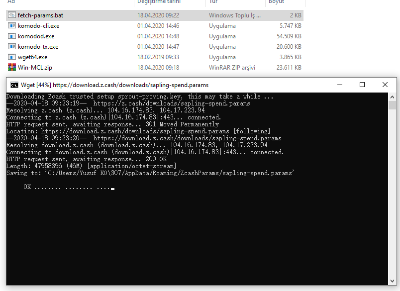
</details>


## 2. ADIM (Path yolu için aşağıdaki resimlerde anlattıldığı gibi sırayla yapınız.)
**<details><summary>DETAYLAR İÇİN TIKLAYINIZ.</summary>**

- Girilecek path yolu : `"C:\Win-MCL"`
- Başlat + CMD yazıp Konsol Açıp ardından konsola `set PATH=%PATH%;C:\Win-MCL\` yazıp entera basınız.
- Veya aşağıdaki resimleri takip ederek yapabilirsiniz.
- adım 1

- 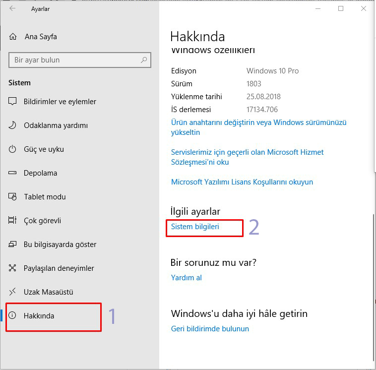
- adım 2 

- 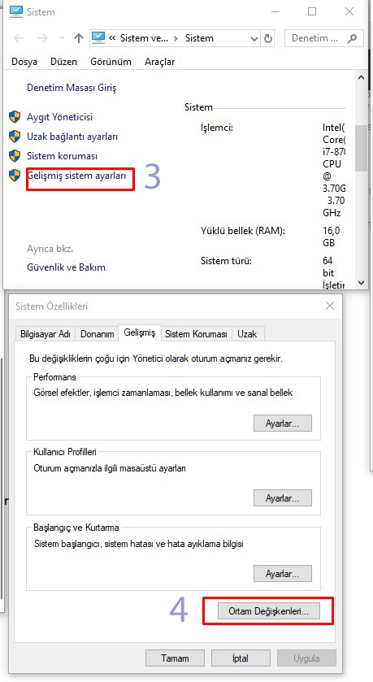
- adım 3

- 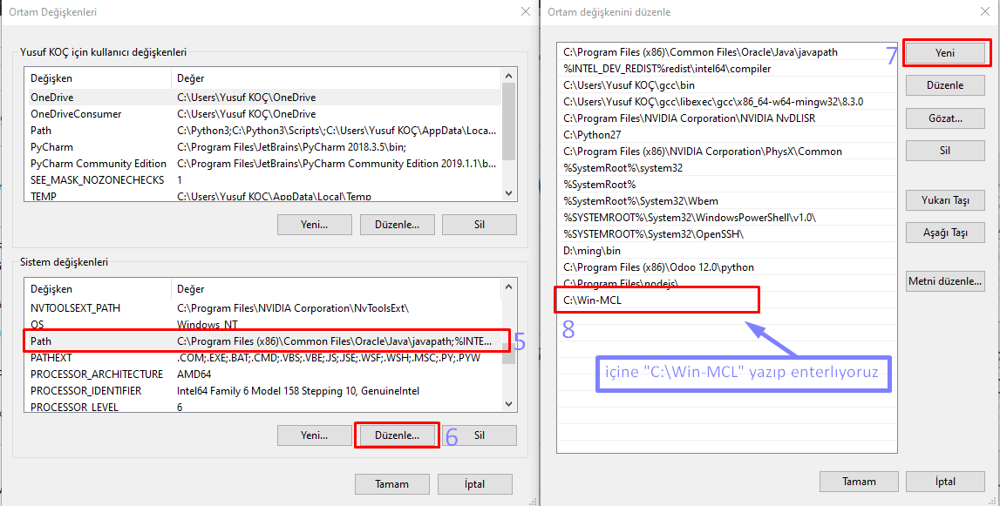
</details>

## 3. ADIM zinciri başlatma.
**<details><summary>DETAYLAR İÇİN TIKLAYINIZ.</summary>**
- 2 adet MSDOS konsolu Açıyoruz (Win+R veya > başlat cmd yazarak "Command Prompt" açabilirsiniz.)
- ilk ekrana MCl zinciri başlatma komutunu giriyoruz. (blokları çekmesini bekliyoruz.)

`komodod -ac_name=MCL -ac_supply=2000000 -ac_cc=2 -addnode=37.148.210.158 -addnode=37.148.212.36 -addnode=46.4.238.65 -addressindex=1 -spentindex=1 -ac_marmara=1 -ac_staked=75 -ac_reward=3000000000 &`
- resim
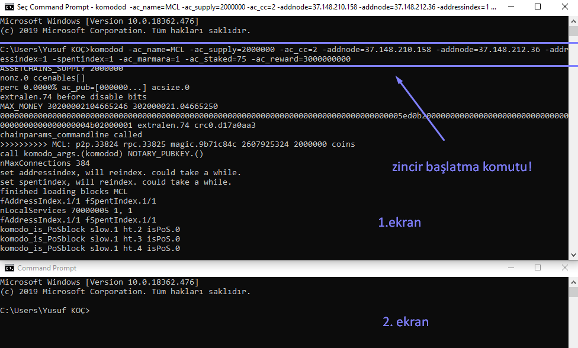
</details>


## Zincire bağlandık!
Not : Blokları çekerken 2. ekranda blokzincirini kontrol edebilir, yeni cüzdan adresi oluşturarak "pubkey" alıp zinciri durdurup pubkey ile yeniden başlatabiliriz. ( zincire bağlandık artık. istediğimiz gibi hesabımızı kontrol edebiliriz.)

# Zincirde yeni  cüzdan adresi oluşturup pubkey ile başlatma.

- yeni cüzdan adresi oluşturuyoruz. ve pubkey alıyoruz.

**<details><summary>cüzdan oluşturma komutu</summary>**

```komodo-cli -ac_name=MCL getnewaddress```
</details>

**<details><summary>pubkey alma komutu </summary>**
 
```komodo-cli -ac_name=MCL validateaddress "walletadresi"```
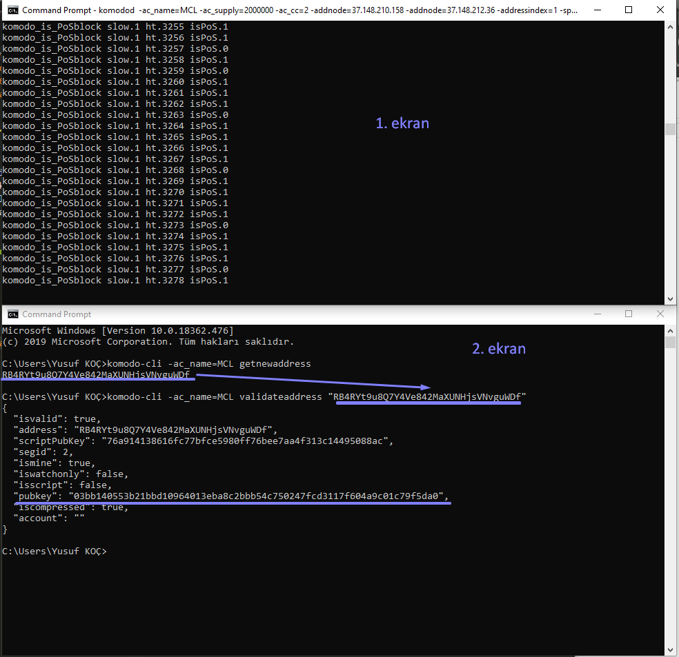
</details>

**<details><summary>bilgileri kaydediyoruz.</summary>**

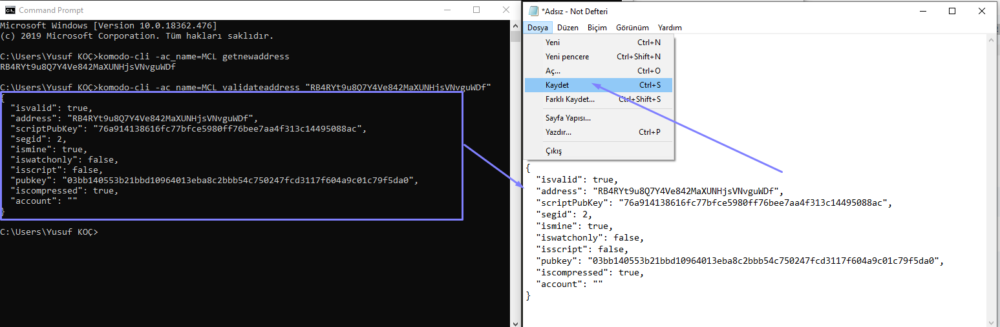
</details>

**<details><summary>zinciri durdurup pubkey ile başlatıyoruz.</summary>**

 - - zinciri durdurma 
 - - ```komodo-cli -ac_name=MCL stop```
 - - zinciri durdurma pubkey ile başlatma

 - - ```komodod -ac_name=MCL -ac_supply=2000000 -ac_cc=2 -addnode=37.148.210.158 -addnode=37.148.212.36 -addressindex=1 -spentindex=1 -ac_marmara=1 -ac_staked=75 -ac_reward=3000000000 -pubkey=03bb140553b21bbd10964013eba8c2bbb54c750247fcd3117f604a9c01c79f5da0```
 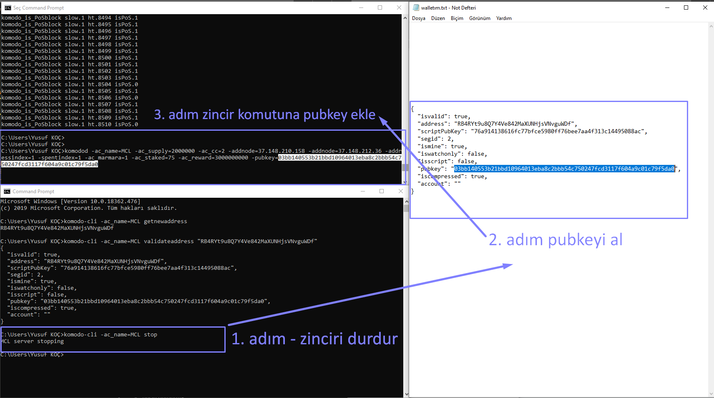
</details>

 ## Zincire pubkeyimiz ile başlattık!

 ### şimdi mining ve staking yapma komutları (2. ekranda yapılacaktır.)
 
**<details><summary>Mining ve staking kontrol etme.</summary>**

 - - ```komodo-cli -ac_name=MCL getgenerate```
  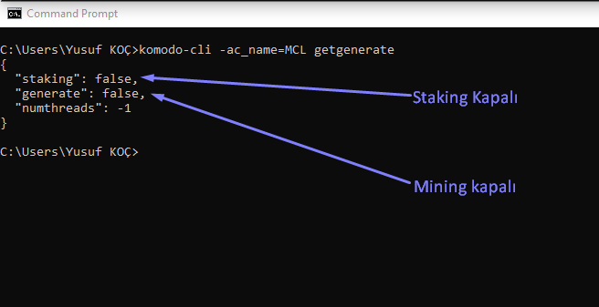
</details>

**<details><summary>Staking açma</summary>**

- - ```komodo-cli -ac_name=MCL setgenerate true 0```
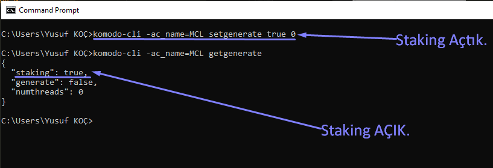
</details>

**<details><summary>Mining açma</summary>**

- - ```komodo-cli -ac_name=MCL setgenerate true 1```
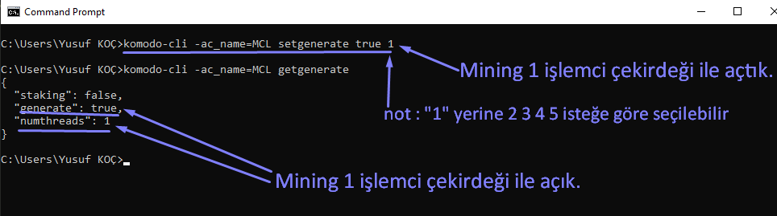
</details>

**<details><summary>Mining ve Staking kapatma.</summary>**

- - ```komodo-cli -ac_name=MCL setgenerate false```
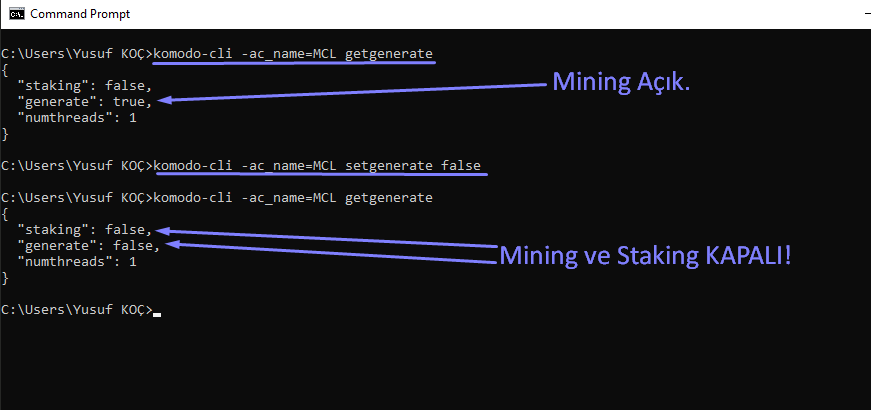
</details>


## genel kontrol komutları.

**<details><summary>wallet info kontrol.</summary>**

- - ```komodo-cli -ac_name=MCL marmarainfo 0 0 0 0 "pubkey"```
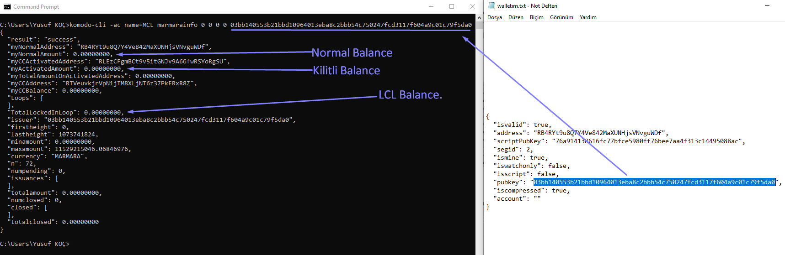
</details>

**<details><summary>coin kilitleme .</summary>**

- - ```komodo-cli -ac_name=MCL marmaralock coinadeti```
- - ```komodo-cli -ac_name=MCL sendrawtransaction "hex"```
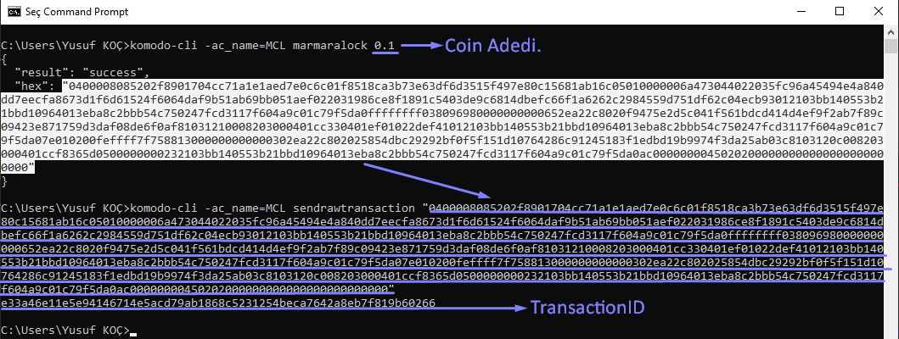
</details>

**Not: Staking açarak kilitli coin ile staking yapabilirsiniz. (ne kadar çok coin kilitlerseniz blok bulma şansınız artar. )**

---
## Kısaca MCL Parametreleri.

**<details><summary>Kredi Döngüsü kontrol etme işlemi.</summary>**
- **`komodo-cli -ac_name=MCL marmaracreditloop txid`**
</details>

**<details><summary>Koin kilitleme.</summary>**
- **`komodo-cli -ac_name=MCL marmaralock amount`**
</details>

**<details><summary>Kredi Döngüsü çek imzalama işlemi.</summary>**
- **`komodo-cli -ac_name=MCL marmaraissue receiverpk "{\"avalcount\":\"n\", \"autosettlement\":\"true\"|\"false\", \"autoinsurance\":\"true\"|\"false\", \"disputeexpires\":\"offset\", \"EscrowOn\":\"true\"|\"false\", \"BlockageAmount\":\"amount\" }" approvaltxid`**
</details>

**<details><summary>Kredi Döngüsü çek isteği işlemi</summary>**
- **`komodo-cli -ac_name=MCL marmarareceive senderpk amount currency matures batontxid "{\"avalcount\":\"n\"}"`**
</details>

**<details><summary>Kredi Döngüsü Transfer işlemi.</summary>**
- **`komodo-cli -ac_name=MCL marmaratransfer receiverpk "{\"avalcount\":\"n\"}" approvaltxid`**
</details>

**<details><summary>Wallet bilgileri.</summary>**
- **`komodo-cli -ac_name=MCL marmarainfo 0 0 0 0 <pubkey>`**
</details>

**<details><summary>Koin gönderme</summary>**
- **`komodo-cli -ac_name=MCL sendtoaddress walletaddress amount`**
</details>

**<details><summary>Staking açma.</summary>**
- **`komodo-cli -ac_name=MCL setgenerate true 0`**
</details>

**<details><summary>Mining açma.</summary>**
- **`komodo-cli -ac_name=MCL setgenerate true 1`** 
</details>

---

### UYARI KULLANACAĞINIZ TÜM KOMUTLAR TAMAMEN KİŞİNİN KENDİ SORUMLULUĞUNDADIR. BU UYARIYI DİKKATE ALARAK EMİN OLMADIĞINIZ KOMUTLARI KULLANMAYINIZ!

- not : emin olmadığınız durumda. yöneticilere başvurduktan ve yöneticilerin size verdiği direktifler doğrultusunda  kullanmanızı ÖNERİYORUZ!

---

### contact :  
B. Gültekin Çetiner http://twitter.com/drcetiner & ~Paro, (c) 2019  

---
Permission is hereby granted, free of charge, to any person obtaining a copy of this software and associated documentation files (the "Software"), to deal in the Software without restriction, including without limitation the rights to use, copy, modify, merge, publish, distribute, sublicense, and/or sell copies of the Software, and to permit persons to whom the Software is furnished to do so, subject to the following conditions:

The above copyright notice and this permission notice shall be included in all copies or substantial portions of the Software.

THE SOFTWARE IS PROVIDED "AS IS", WITHOUT WARRANTY OF ANY KIND, EXPRESS OR IMPLIED, INCLUDING BUT NOT LIMITED TO THE WARRANTIES OF MERCHANTABILITY, FITNESS FOR A PARTICULAR PURPOSE AND NONINFRINGEMENT. IN NO EVENT SHALL THE AUTHORS OR COPYRIGHT HOLDERS BE LIABLE FOR ANY CLAIM, DAMAGES OR OTHER LIABILITY, WHETHER IN AN ACTION OF CONTRACT, TORT OR OTHERWISE, ARISING FROM, OUT OF OR IN CONNECTION WITH THE SOFTWARE OR THE USE OR OTHER DEALINGS IN THE SOFTWARE.
